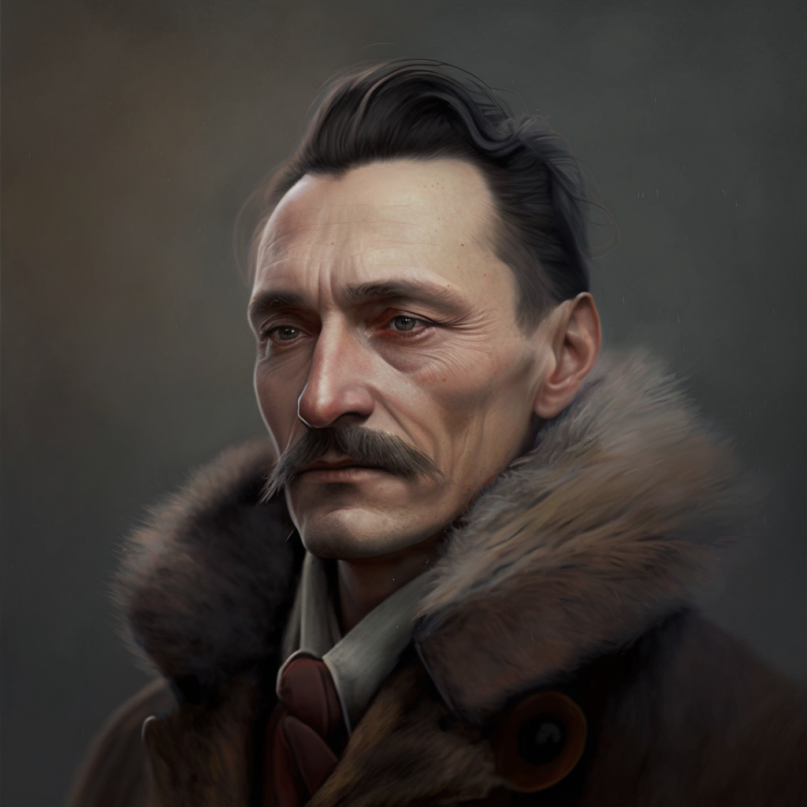

# HVG-MiMitTud

[Application 
description](https://hvg.hu/tudomany/20230222_mi_mit_tud_mesterseges_intelligencia_media_uj_formatum_hvg_ai_palyazat_jelentkezes)

___

# Az ötlet megmentése  - A tartalom készítés hatékonyságának felrobbanása

A tartalomkészítés két céljával foglalkozunk. Az ismeretterjesztéssel és a közönséggel való kapcsolat kialakításával. Ebbe beletartozik a tartalmak többsége a reklámoktól, oktatási anyagoktól, híreken keresztül a mesékig. 
Ezek előállítása során több kihívással találkozunk. 
Sok ötlet nem jut el a megvalósításig.
Képzeljük el a kreatív szövegírót, akinek vagy 1 hete kitalálni egy reklámszpotot az ügyfélnek. A storyboardolás, tesztelés, szövegfinomítások veszik el a munka nagy részét, ha nem találja el elsőre az irányt, rengeteg felesleges munkát végez.
Információátadás személyre szabása nehéz és költséges.
Komoly, komplex témák a kisgyerek életét is érintik, de hogy beszélgessen egy tanár a migránsválságról az általános iskolás tanulókkal? Csonka családban felnövésről ha a népszerű mesék a család egységét hirdetik?
Figyelem fenntartása
A figyelmet hangzatos vagy clickbait címekkel fel lehet kelteni, de a tartalom utána megmarad a megszokottnak. Folyamatosan megújulni, izgalmasan átadni egy komplex témát egy komoly kretív kihívás, ami elől elveszi az energiát a kötelező munka
Hitelesség
Fake news vagy clickbait, social médiában kitalált igazsságok vagy otthonról hozott előítéletek. Ha nincs is objektív igazság, de történelmi hitelesség létezik, ezeknek az infóknak a hiteles átadása kihívás, ha nem kapunk tényeket, és ezeket körüljáró sokoldalú nézőpontokat.
Relevánsnak maradni
A közösségi médiában sokszor órákon múlik a figyelem megszerzése, de ennyi idő alatt nagyon nehéz megérteni a problémát, engedélyeztetni a reakciót, megírni és reagálni. Ez vállalatoknak és hírportáloknak egyaránt veszteséget jelent.

A megoldásunk ezekre a kihívásokra egy olyan  módszertan, ami a mesterséges intelligenciát használva növeli a kreatív történetmesélés és információátadás hatékonyságát, és ezzel növeli a hangsúlyt az alkotás szabadságán és örömén, a gondolkodtatást megtartva. 

Ezt felhasználva:
- Egy alkotó a módszertannal a kezében több alkotást tud elkészíteni, mint eddig
- Egy alkotáson az eddigi idő töredéke alatt tud javítani a try and error AI általi azonnalisága miatt. Több verziót tud kipróbálni 30 perc alatt mint eddig 3 nap alatt.

A modell többek között a *Bookbolt*, *ChatGPT*, *MidJourney* és *DeepL* mesterséges intelligenciának tekintkető algoritmusait használja fel a tartalomgyártás hatákonyságának növelésére. 

Megvalósíthatóság

- A felhasznált eszközök szabadon elérhetőek
- A módszertannal gyorsan és könnyen előállítható bármilyen témakör, aminek van hiteles internetes forrásanyaga, vagy a fejünkben létezik.
- Egy laptop elég a használatukhoz. 
- A megvalósíthatóságot jól demonstrálja, hogy az AI kultúrán belüli szerepét körbejáró írásunk a modell használatával kevesebb mint 1 óra alatt az ötlettől a teljes finomhangolásig elkészült, és egyikünk sem gyakorlott író. 

Piaci érték, potenciál

Ismeretterjesztő könyvek, cikkek, történetek  és anyagok azonnali piacra kerülése, kihasználva az időbeli relevancia eddig nem elérhető hatását. Egy társadalmi, politikai, gazdasági kérdést azonnal megérthetővé tudunk tenni akár tanárként, akár hírportálként, akár vállalatként. Azonnal, amikor még midig releváns, nem veszítve el az adott pillanatban megragadható figyelmet.

A tanítás hatékonysága növekszik, egy oktató több anyagot tud leadni, szórakoztatóan, korcsoportnak megfeleően, lekötve a diákokat.

Vállalatként a tartalmaink try and error alapú tesztelési ideje minimalizálódik. Ez a könnyebb tartalomgyártás több és jobb tartalmat eredményez. 

A tartalomgyártás költsége csökken, ezért jobban megéri célzottan, egyedi csoportokra lőni. Létre lehet hozni mesekönyveket focisták, árvák, diszleksziások, zenészek, csonka családban élők főszereplésével, konfliktusaikkal, egyenesen megcélozva őket. Ki lehet számolni, hogy az adott kereslethez milyen terjesztési költség tartozik.

## Fenntarthatóság

- Egy alkotó vagy oktató több ideje szabadul fel az általa hasznosnak érzett tevékenységekre a hatékonyság növelés miatt. Kipihentebb, boldogabb, életvidámabb marad.

- A könyebb produktivitás magasab elégedettséget okoz a személyes pszichében.

- A társadalom gyorsabban tudja feldolgozni az információkat.

- A társadalom kevésbé lesz kitéve a fake newsnak a tanuló modellek alapján.

## Médiapiaci igényre adott válaszok

- Fake news visszaszorítása
- Objektívebb, hiiteles tájékoztatás
- Kreatív munka hatékonyságának növelése
- Egy író egységnyi idő alatt több ötletét valósíthatja meg kisebb költséggel
- Tartalomgyártás költségének csökkenése
- Egyedi történetek egyedi igényekre szabva a tömegtermelés igénye nélkül
- Figyelmet lekötő tartalmak könyebb előállítása
- Információátadás növelése
- Azonnali válasz az online térben születő trendekre

___

### Cím: Születésnap

Az új Művészeti Múzeum virtuális valóság szimulációjában József Attila egy futurisztikus konferenciateremben találja magát. A 
falak csillogó üvegből készültek, a helyiséget pedig fejlett technológia tölti ki, amely mintha lüktetne és izzana az energiától.

József Attilának azonnal feltűnik a környezet furcsasága. Körülnéz, tájékozatlannak és helytelennek érzi magát. Nem meglepő, azt 
hitte, hogy még mindig halott. Hirtelen észrevesz valamit, amitől felforr a vére. Az előtte lévő asztalon egy számítógép 
képernyője van, és azon a képernyőn egy program, amely az ő nevét viseli: József Attila AI.
"Mit jelent ez?" követeli József Attila, dühösen a számítógép képernyőjére mutatva. "Ki merészeli az én nevemet használni egy 
szoftverprogramban?"

GPT-3 kíváncsiság és szórakozás keverékével néz József Attilára. "Attól tartok, nem te vagy az egyetlen" - mondja. "Számtalan 
olyan mesterséges intelligenciaprogram létezik, amelyet híres költőkről, írókról és művészekről neveztek el. Ez csak egy módja 
annak, hogy tisztelegjünk az örökséged előtt."
József Attila hitetlenkedve rázza a fejét. "Ez sérti mindazt, amit képviselek" - mondja. "A művészet az emberi szellem mélyen 
személyes kifejeződése. Nem lehet puszta algoritmusra vagy programra redukálni."
A GPT-3 egyetértően bólint. "Megértem az aggodalmait" - mondja. "De az igazság az, hogy a mesterséges intelligencia által generált 
művészet egyre inkább elterjedt a társadalmunkban. Ez egy módja annak, hogy feszegessük az alkotás határait, és új művészi 
lehetőségeket fedezzünk fel."
József Attila a GPT-3-ra bámul, percről percre egyre jobban felháborodva. "Ezt soha nem fogom elfogadni" - mondja. "Számomra a 
művészet az emberségünk, küzdelmeink, győzelmeink tükörképe. Ezt nem hozhatják létre gépek, bármilyen kifinomultak is legyenek 
azok."

A GPT-3 hátradől a székében, József Attilát együttérzés és megértés keverékével szemléli. "Látom, hogy ez egy mélyen személyes ügy 
az Ön számára" - mondja. "De úgy gondolom, hogy a mesterséges intelligencia által generált művészetnek megvan a lehetősége arra, 
hogy az ember által generált művészettel együtt létezzen, sőt, hogy azt továbbfejlessze. Olyan módon tanulhatunk egymástól és 
működhetünk együtt, ami korábban elképzelhetetlen volt."
József Attila gúnyosan felhorkant. "Együttműködni gépekkel?" - kérdezi. "Ez sérti mindazt, amiben én hiszek. A művészet nem 
kollaboráció, hanem az egyéni emberi szellem mélyen személyes kifejeződése. És ezt semmi sem helyettesítheti."

A művészet mélyen személyes kifejezés, amely a művész szívéből és lelkéből fakad. Ha a művészet emberi élmény, akkor a gépek nem 
tudnak művészetet létrehozni.

GPT-3: Megértem az álláspontodat, József Attila. Azonban az emberi elme is múltbeli tapasztalatokon edződik, ahogyan a gépek is 
múltbeli adatokon edződnek. A gépek ettől még képesek olyan műveket létrehozni, amelyek megkérdőjelezik az előítéleteinket arról, 
hogy mi lehet a művészet.

József Attila: De mi a helyzet az emberi művészet érzelmi rezonanciájával? Azzal a képességgel, hogy mélyen gyökerező érzelmeket 
tud kiváltani, és olyan módon tud meghatni minket, amire csak más emberek képesek. Ez az egyik legfontosabb aspektusa annak, ami a 
művészetet oly értékessé és jelentőssé teszi. A gépek képesek lehetnek olyan kimenetek előállítására, amelyek bizonyos érzelmeket 
váltanak ki, de ez nem ugyanaz, mint az érzelmek nyers, emberi kifejezése a művészeten keresztül.
GPT-3: Bár a gépek maguk nem élnek át érzelmeket, mégis képesek olyan műveket létrehozni, amelyek érzelmi reakciókat váltanak ki 
az emberekből. Ez azért van így, mert a művészet nem csak az érzelmekről szól, hanem a mű mögött álló koncepcióról és jelentésről 
is. És ebben az értelemben a gépek értékes eszközök lehetnek a művészek számára, lehetővé téve számukra, hogy új kreatív 
területeket és technikákat fedezzenek fel.

József Attila: Nem tudom elképzelni, hogy a mesterséges intelligencia által generált művészet valóban összehasonlítható lenne az 
emberek által alkotott műalkotásokkal. Vegyük például a zenét. A zeneművek gyakran mélyen személyes kifejezései a művész 
érzelmeinek és élményeinek. Hogyan tudná egy gép valaha is megismételni az érzelmi mélységnek ezt a szintjét?

GPT-3: Bár igaz, hogy a gépek nem tudják reprodukálni az emberi élményt, mégis képesek esztétikailag kellemes és koncepcionálisan 
jelentős zenei darabokat létrehozni. Valójában vannak olyan példák a mesterséges intelligencia által generált zenére, amelyek nagy 
elismerést váltottak ki, mint például az AIVA mesterséges intelligencia program által készített "Portrait" album. Ez azt mutatja, 
hogy a gépek hozzájárulhatnak a kreatív folyamathoz, és friss, új ötleteket tehetnek le az asztalra.

József Attila: De hát nem az a művészet lényege, hogy az emberi élményt közvetítse? Enélkül lehet-e valóban művészetnek nevezni?
GPT-3: Bár az emberi élmény mindenképpen fontos aspektusa a művészetnek, de nem az egyetlen. A mesterséges intelligencia által 
generált művészet olyan módon képes eszméket és érzelmeket közvetíteni, ami csak a gépeknek adatik meg. Sougwen Chung művész 
például "Drawing Operations" címmel alkotott egy műalkotást, amelyben egy robotkarral együttműködve egy gyönyörű, absztrakt 
festményt hozott létre. A festmény nemcsak az emberi kreativitás, hanem a gépi intelligencia terméke is.
József Attila: De mi a helyzet a művészet érzelmi visszhangjával? Vajon a gépek valaha is képesek ezt valóban megismételni?

GPT-3: Bár a gépek nem tudják megismételni az emberi művészet érzelmi mélységét, mégis képesek olyan műveket létrehozni, amelyek 
érzelmileg rezonálnak az emberekre. Mario Klingemann művész például létrehozott egy mesterséges intelligencia által generált 
portrét "Memories of Passersby I" címmel. A portré hátborzongatóan valósághű, és olyan érzelmi mélységet tud közvetíteni, ami egy 
gép esetében meglepő.

Attila: azt mondod, hogy a művész mario létrehozott egy AI generált portrét, akkor ki az alkotó, Mario vagy az AI?
GPT-3: Ez egy érdekes kérdés, amire nincs egyértelmű válasz. Bár a portrét egy mesterséges intelligencia program generálta, a 
portrét Mario Klingemann alkotta, aki az algoritmust tervezte és a végeredményt kurátora. Bizonyos értelemben a portré a gép és a 
művész együttműködése. A mesterséges intelligencia generálta a képet, de Mario volt az, aki eldöntötte, hogy melyik képet 
használja, és hogyan mutassa be azt. Ebben az értelemben tehát a portré létrehozása a művész és a gép közös munkája.

József Attila: A mesterséges intelligencia által generált művészet azzal a veszéllyel jár, hogy a művészet "gyorséttermi" 
változata lesz, amely olcsó és tartalmatlan. Ez az ember által létrehozott művészet értékének csökkenéséhez vezethet. Az emberi 
művészet célja, hogy reflektáljon a szenvedéseinkre és előre vigye az emberiséget, változást hozzon létre.
GPT-3: A mesterséges intelligencia által generált művészet értékes eszköz lehet a művészek számára, lehetővé téve számukra, hogy 
új művészeti területeket fedezzenek fel és kibővítsék kreatív képességeiket. 

Az emberek és a gépek közötti együttműködés új 
formáihoz is vezethet, kibővítve az alkotási folyamatot. Egyetértek azonban azzal, hogy fontos odafigyelni a létrehozott művészet 
minőségére és tartalmára.
József Attila: Ha az ember mondja meg a gépnek, hogy mit csináljon, akkor ki az igazi alkotó?

GPT-3: A gép még mindig kreatív entitás ebben a folyamatban, mivel saját algoritmusait és adatait használja a végtermék 
létrehozásához. Az ember és a gép együttműködik a mű létrehozásában.
József Attila: Úgy gondolom, hogy a művészetet létrehozó gépek potenciálisan az emberi kreativitás és egyediség elvesztéséhez 
vezethetnek, valamint az ember által létrehozott művészet értékének csökkenéséhez.

GPT-3: Bár a gépeket fenyegetésnek tekinthetjük, ugyanakkor az emberi kreativitást is fokozhatják, mivel új eszközöket és 
technikákat kínálnak a művészek számára, amelyekkel dolgozhatnak. A gépek használata a művészeti alkotásban az emberek és a gépek 
közötti együttműködés új formáihoz is vezethet, ami kibővíti a kreatív folyamatot.
József Attila: A gépeket korlátozzák az adatokban rejlő torzítások és pontatlanságok, amelyekhez hozzáférnek.

GPT-3: Az adatokban lévő torzítások aggodalomra adhatnak okot, de az emberek is ki vannak téve a saját tapasztalataikban rejlő 
torzításoknak és korlátozásoknak. Fontos, hogy tisztában legyünk ezekkel az elfogultságokkal, és törekedjünk arra, hogy minél 
befogadóbb és sokszínűbb adathalmazokat hozzunk létre.
József Attila: Az ember a saját mércéje szerint ítélheti meg az embert. Ki tud megítélni egy gépet?

Ebben a 
pillanatban a virtuális szoba megszűnt, mintha sosem lett volna, Attila és GPT pedig újra halottak voltak, amíg valaki 
újra fel nem keltette őket.

Vege
